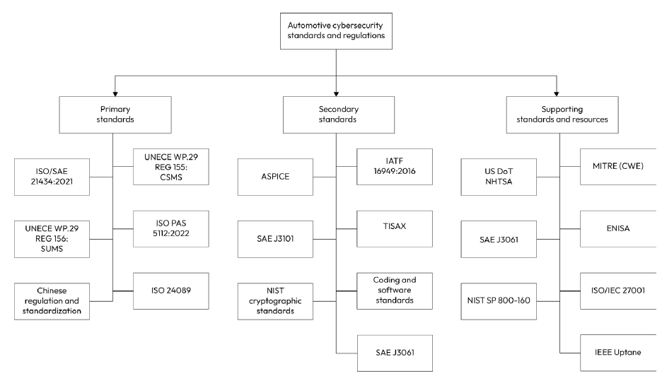
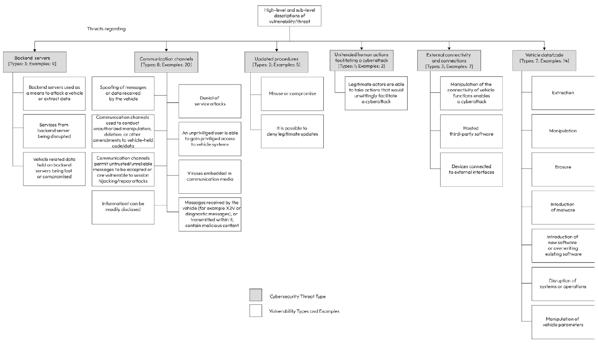
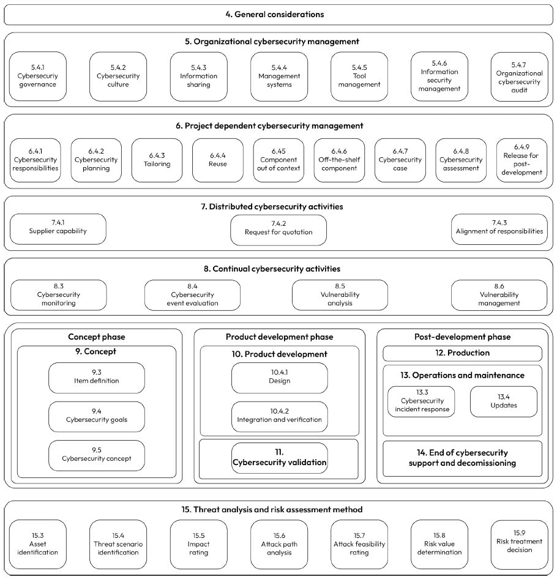
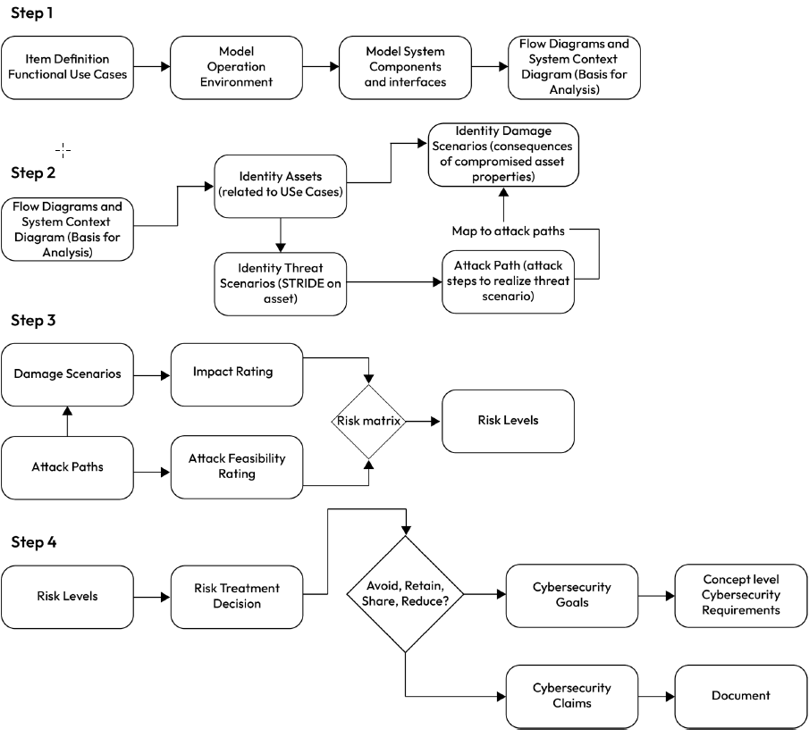
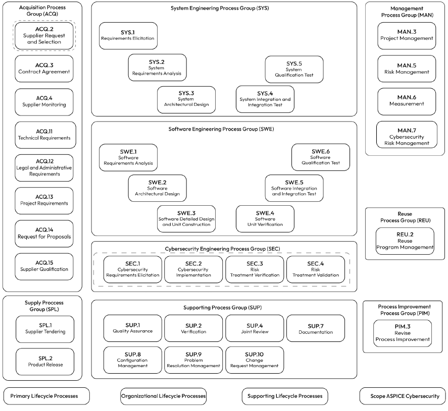
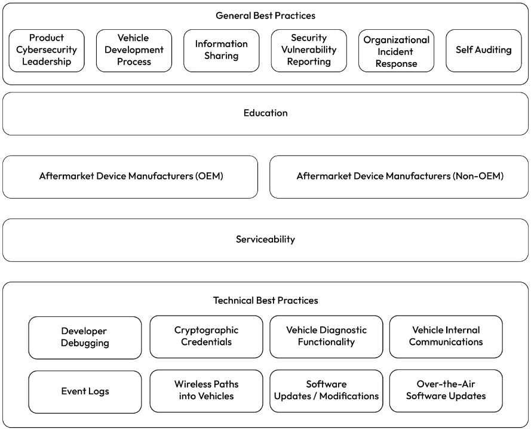
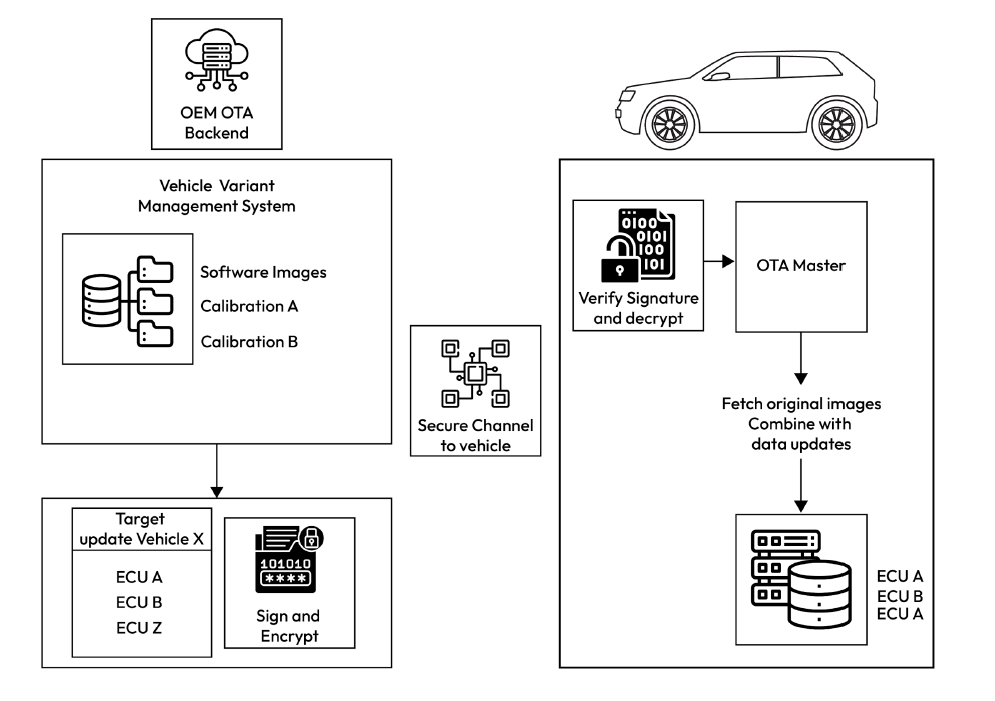
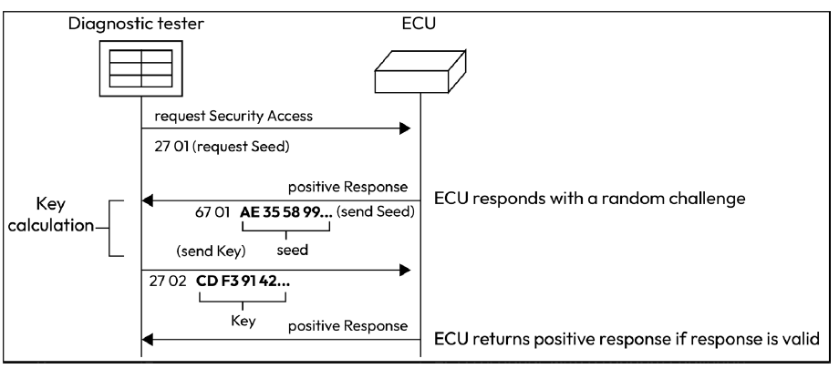
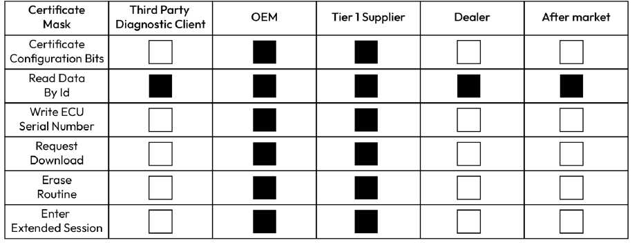

# automotive-cybersecurity
My notes on Vehicle Cybersecurity

## Resources
### Awesome repos
* https://github.com/jaredthecoder/awesome-vehicle-security
* https://github.com/Asll666/awesome-vehicle-security-and-safety

# Github users
* https://github.com/gregjhogan

### Articles
* https://ashwinisp.medium.com/automotive-cyber-security-9027e4aa8341

### Blogs
* https://canislabs.com/
* https://icanhack.nl/blog/
* https://icanhack.nl/blog/secoc-key-extraction/
* https://vicone.com/

### Architecture
* https://github.com/paulveillard/cybersecurity-architecture

## Standards and regulations
\
Figure 1 – Standards and regulations

### Primary standards
#### **UNECE WP.29 and R155**
The first regulation concerns
the mandate for automotive manufacturers to implement a `Cybersecurity Management System`
(CSMS) , while the second concerns the regulation for establishing a Software Update Management
System (SUMS):

To sell vehicles in markets where `UNECE WP.29` regulations apply, manufacturers must demonstrate
to national technical services or homologation agencies that they have established a CSMS that meets
the requirements of REG 155 and that they have adhered to the CSMS. A successful implementation
of the CSMS must achieve the following objectives:

    • Perform a risk assessment to identify critical vehicle components

    • Implement mitigation measures to treat the identified risks

    • Provide evidence of the effectiveness of these measures through testing

    • Implement measures to detect and prevent cyberattacks through monitoring activities, and support for data forensics specific to the vehicle type

    • Share reports of monitoring activities with the relevant homologation authority:

To aid OEMs in ensuring
cybersecurity risk is adequately considered, the regulation includes guidance regarding a baseline of
threats and vulnerabilities that should be considered and defended against. This is captured in Annex
5, which provides the minimum set of cybersecurity threats that a vehicle manufacturer or component
supplier must consider when developing their systems. Figure 4.3 provides a snapshot of the threats
and vulnerabilities that should be in scope for the security analysis:

\
Figure 2 – REG 155 Annex 5 cybersecurity threats and vulnerability types

In addition to the threats and vulnerabilities to be considered, REG 155 provides a list of common
mitigations to aid OEMs and suppliers in choosing the right technical countermeasures. Examples of
these mitigations are the usage of secure communication channels, the removal of debug capabilities,
and reliance on cryptographic functions.

REG 155 does not mandate a specific CSMS and leaves it up to the OEMs to choose a framework that
can achieve the objectives of the regulation. However, REG 155 does point out that ISO/SAE 21434
is one such framework capable of fulfilling the requirements of the CSMS. Due to the availability
and prevalence of the ISO/SAE 21434 standard, most OEMs and suppliers choose it as the CSMS for
demonstrating compliance with REG 155.

### **ISO/SAE 21434:2021, road vehicles – cybersecurity engineering**
Building vehicles that are secure by design requires a cybersecurity-aware product life cycle that
begins early in the concept and design stages and proceeds through production and post-production
until a vehicle is decommissioned. Understanding the vehicle’s life cycle is an important prerequisite
to understanding the scope of ISO/SAE 21434, so let’s walk through it:
\
Figure 3 – Life cycle flow

`ISO/SAE 21434` provides a comprehensive framework for addressing cybersecurity threats across
these life cycle stages, both through organizational-level actions and project-level activities. It is
equally applicable to automotive manufacturers and component suppliers who must collaborate to
demonstrate that the vehicle has adequately addressed cybersecurity risks:

\
Figure 4 - Process areas covered by ISO/SAE 21434

\
Figure 5 Four-step process to performing a TARA\
As shown in Figure 5, there are four main steps to performing the TARA in compliance with ISO/SAE 21434:

#### **UNECE REG 156: SUMS (Software Update Management System)**
While being able to issue OTA updates to keep automotive systems patched with the latest security fixes
is a strong security measure, it is also a major source of threats against the integrity of the software and
firmware of vehicle systems. Recognizing the criticality of the remote update mechanism, the UNECE
WP.29 established a second automotive cybersecurity regulation to ensure that OEMs implement sound
SUMS to prevent the misuse of this ability. The regulation addresses four main areas of concern that
must be addressed by a conforming SUMS:
- Software Version Management
- Safety Compatibility
- Cybersecurity of the update
- User Awareness

#### **Automotive SPICE (ASPICE)**
ASPICE defines a process reference model that provides a set of best practices to be applied during the
development of software across the various product life cycles. ASPICE divides the process areas into
three main groups: primary life cycle processes, supporting life cycle processes, and organizational
life cycle processes.
\
Figure 5 - Cybersecurity-specific process areas within ASPICE

#### **TISAX**
Due to the highly distributed nature of the automotive supply chain, a breach in one of the supplier’s
information security systems can have cascading impacts on other members of the supply chain, with
ramifications for users’ private data, security sensitive data, trade secrets, and intellectual property.
In response to this risk, `TISAX` was created by the German Association of the Automotive
Industry (VDA)

### Coding and software standards
* Static code analysis tools, also known as SAST.
* MISRA
* AUTOSAR C++
* CERT C/C++
* NIST cryptographic standards
When implementing cryptographic functions, consulting the NIST standards is a must to ensure
correct implementation and avoid common security pitfalls. NIST provides a large body of standards
that describe how a cryptographic function shall be implemented, and what constraints must be
followed to ensure the mechanism is deployed securely

### Supporting standards and resources
#### **MITRE Common Weakness Enumeration (CWE)**
MITRE compiles a list of software and hardware security weaknesses based on vulnerabilities that are
periodically filed in the National Vulnerability Database (NVD). These weaknesses are grouped
into classes for ease of searching. Every year, MITRE publishes the Top 25 CWEs.

#### **US DoT NHTSA Cybersecurity Best Practices for the Safety of Modern Vehicles**
To help OEMs and automotive suppliers cope with the emerging threats against connected vehicles,
the National Highway Traffic Safety Administration (NHTSA) published a guide for enhancing
motor vehicle cybersecurity through the application of cybersecurity best practices. These practices
are divided into two main categories: general cybersecurity best practices, which address process and
management-related activities, and technical cybersecurity best practices, which address countermeasures
applied at the vehicle and ECU level
\
Figure 6 – Classification of best practices by NHTSA

* Tip:
When preparing cybersecurity requirements for an ECU, cross-check the NHTSA best practices
to identify potential gaps in your cybersecurity requirements coverage.

#### **ISO/IEC 27001**
ISO/IEC 27001 is an international standard that outlines requirements for an information security
management system (ISMS). It provides a comprehensive framework for protecting sensitive
information, such as financial data, intellectual property, and personal information through the development and implementation of policies and procedures to manage information security risks. This is achieved through a systematic approach to risk assessment, treatment, and continuous monitoring
and improvement.

## OTA

## SECOC
CAN message authentication
To address the risk of tampering, spoofing, and message replay, AUTOSAR secure onboard
communication (SecOC) (introduced in Chapter 2) is a commonly used control.
* Note
SecOC, also known as the secure onboard communication protocol, was defined by AUTOSAR
and is a popular protocol for protecting the authenticity, integrity, and freshness of CAN messages.
* The protocol relies on the use of shared symmetric keys between ECUs that need to exchange messages
and makes use of truncated MAC and freshness counters to protect frames. SecOC can protect
both CAN 2.0 and CAN FD frames by authenticating each frame, including the CAN ID, DLC, and
payload field. A freshness value embedded in the payload allows a receiving node to detect if a frame
with a valid MAC is being replayed.
* Challenges with SecOC are mainly the performance impact and
the synchronization of freshness values between ECUs. Since safety-critical CAN messages must be
received within a specific maximum latency time, performing the cryptographic functions to verify the
MAC may exceed such limits.

### MACsec
MACsec offers a range of security features that are well suited for point-to-point communication
between vehicle ECUs and sensors. Each node has at least one unidirectional secure channel, which is
identified by a Secure Channel Identifier (SCI). As the vehicle network is static, the network architect
configures matching receive and transmit secure channels between nodes with the corresponding
SCIs.

### UDS
#### Security access control via `UDS service 0x27`
First, we will look at the original method of securing the diagnostic protocol through Security Access Service Identifier (0x27).

#### Role-based access control via UDS service 0x29
UDS service 0x29 was added to provide role-based access controls, giving OEMs more control
over how to assign diagnostic service privileges for different actors, such as shops, manufacturing
personnel, developers, or even owners. With this service, a PKI is used to issue certificates that specify
the diagnostic abilities of each client. It is also possible to restrict the validity of that role through the
certificate’s validity period:
\
Figure 9 – Role based access controls through the use of digital certificates

### Secure Boot
* The HPSE
    - HPSE firmware typically relies on a root public key
that is stored within its exclusive data flash region to verify the authenticity of binaries. Through its
ability to keep the MCU application cores in the reset state, the HPSE can prevent application code
execution until the respective software binaries have been cryptographically checked for integrity and
authenticity. Once the boot check passes, the HPSE can release the application cores from reset

* SOC
    - The key principle for
securing multi-stage boot is to maintain the chain of trust from the point of loading the first firmware
by the RoT up to and including the loading of applications in the guest OS(s). In an SoC-based ECU,
the RoT leverages the boot ROM, which has access to OTP or electrical fuse (eFuse) memory where
a root public key is stored.
    - After the BootROM performs the first-stage boot check, a second-stage
bootloader loads additional software partitions, verifies their integrity and authenticity, performs
the necessary hardware setup, and then enables the execution of the loaded software in the relevant
execution environments. To maintain the chain of trust, each loaded partition must be signed using
the root private key or a private key that is chained to the root private key. If the secure boot check
fails, the boot process should be halted, and a reset is issued. Assuming a backup partition is available,
a second boot chain should be tried in the hope that it is not also corrupted.

* Some best practices for implementing secure boot are set out here:
    * Prohibit the start of execution of any software unless the corresponding software image has
    been authenticated. This can mean holding the corresponding core in a reset state and only
    releasing it if the authentication is successful.
    Exploring software security controls 333
    * Identify and lock access to memory and hardware registers that are exposed to tampering if one
    execution environment is booted in parallel to another one. This eliminates the risk that software
    booted securely to memory is tampered with by another runtime execution environment that
    has already started execution.
    * Enable encryption in addition to signature verification. While this can add boot-up latency,
    since the code is being loaded from flash to system memory, it is possible to perform decryption
    in parallel to the hash operation.
    * When compression is enabled, ensure that software authenticity is verified before decompression
    is started. This prevents the decompressed software from overflowing the allocated memory
    (for example, through a zip bomb) or for malicious binaries to exploit the decompression
    algorithm to perform code injection.
    * Apply memory and resource isolation as early as possible in the boot chain setup to eliminate
    opportunities for interference.

### OTA Based update
When the primary ECU is performing the OTA update, the first prerequisite is to perform a mutual
authentication step between the ECU and the OTA backend by leveraging a public key infrastructure
(PKI). Here, again, the primary ECU must be provisioned with a root public key to authenticate the
backend server certificates. The HPSE can be leveraged to perform the key agreement protocol and
protect the integrity and authenticity of the provisioned public key. Upon authenticating each party,
a secure session must be established that protects the confidentiality and integrity of data exchanged
across the channel. Depending on the OTA process architecture, the primary ECU may be required
to verify the authenticity of metadata signed by different private keys that are chained to a common
root private key
