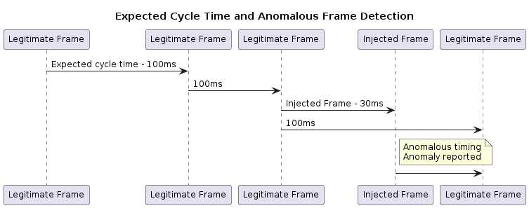

# IDPS - intrusion detection and prevention system

## CAN IDPS
An IDPS recognizes irregularities in messages as well as deviations from the expected sequence. This may be manifested in several ways, such as:

* Message content – Each message has a predefined structure and set of allowed values. An IDPS can detect when this structure and values are violated.

* Message transmission timing – Each message on a CAN bus has its own transmission method and expected intervals. For example, a periodic message is expected to be seen on the bus only once for every cycle time. Deviation from this timing is detectable by an IDPS, even if the message is well constructed (see diagram below).
\
Figure 1 – [Anomalous Frame Time detection](https://www.plantuml.com/plantuml/uml/ZP6zJiD03CTtFuNLlLBJC7L0hO18bIeM65cin0s6d2-wSoJAqsDnWj01AUFvVlyFt-spKR8f393VHKTA5B3ZCqs3DL7jaGBZ8GdzS_yadupL5i341iQ7Zv5RumxlBgqVdyNLf1qUD0OQufInSGF6UpRd92g0MvgqCf8QhaxSYqaWumAka3AUcceHjLr4rTVKKTzAuvavDekCRW2y6QvlqQDnD-_UVk_k2iOrLfjDoE140UlTxwJsYMUvyhg3Y-e_X0VXZqYZCIRfNmtZkMZdb_L0qVv5o-I2YSUOt1MSApwmP-tygxy0)

* Pattern recognition – When considering a specific process or a specific attack, we expect to see a known pattern of messages (or lack thereof). An IDPS can be set to identify such patterns and alert accordingly.

## Online knowledge
### Articles/Blogs
* [Argus ethernet protection](https://argus-sec.com/products/ethernet-protection/)
* [Argus can protection](https://argus-sec.com/products/can-protection/)
* [Argus can protection technical blog](https://argus-sec.com/blog/blog-post/what-oems-can-do-to-prevent-can-injection-car-theft/)

### Implementations
* [wolfsentry](https://github.com/wolfSSL/wolfsentry)
* [suricata](https://suricata.io/)
