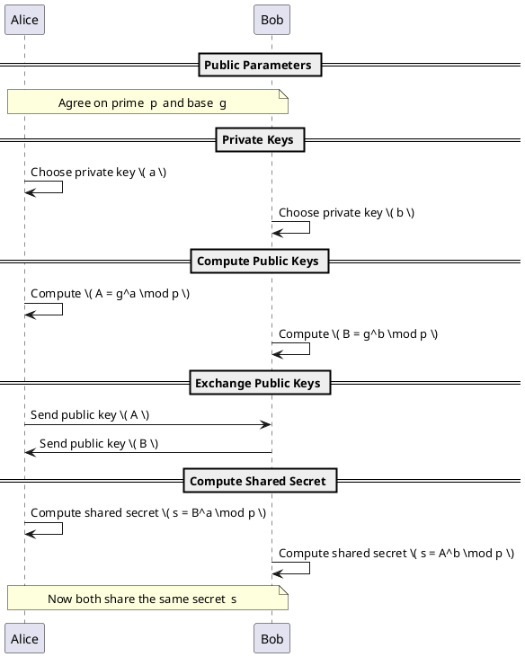

### Diffie Helman Key Agreement

```plantuml
@startuml
participant Alice
participant Bob

== Public Parameters ==
note over Alice,Bob: Agree on prime \( p \) and base \( g \)

== Private Keys ==
Alice -> Alice: Choose private key \( a \)
Bob -> Bob: Choose private key \( b \)

== Compute Public Keys ==
Alice -> Alice: Compute \( A = g^a \mod p \)
Bob -> Bob: Compute \( B = g^b \mod p \)

== Exchange Public Keys ==
Alice -> Bob: Send public key \( A \)
Bob -> Alice: Send public key \( B \)

== Compute Shared Secret ==
Alice -> Alice: Compute shared secret \( s = B^a \mod p \)
Bob -> Bob: Compute shared secret \( s = A^b \mod p \)

note over Alice,Bob: Now both share the same secret \( s \)
@enduml
```
