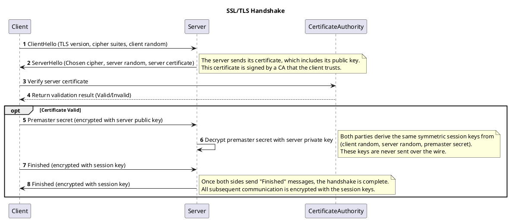
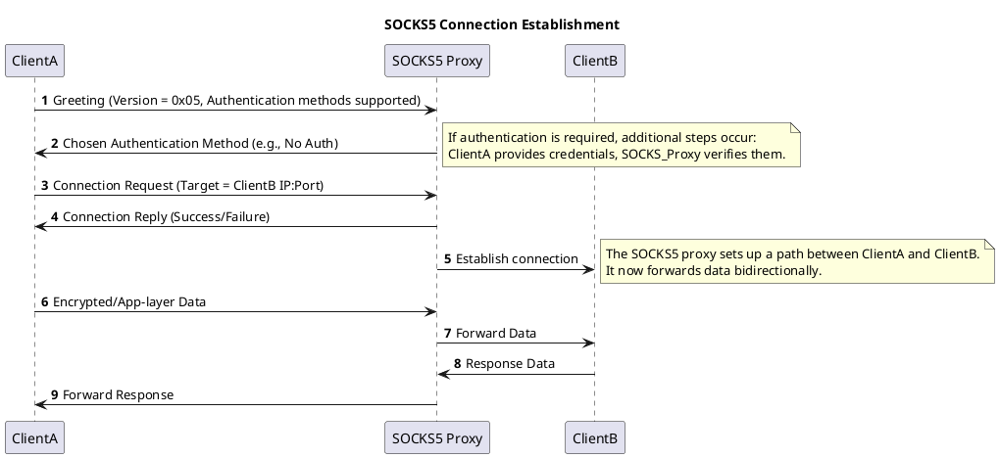

# Netwok Security Protocols

## Application Layer

### Core Concepts
- **Protocols operate at specific OSI or TCP/IP layers** and follow the functionality defined at that layer.
- **TCP and UDP-based protocols use specific network ports**. Understanding port assignments is crucial for firewall configurations, intrusion detection, and monitoring.

### HTTPS (HTTP Secure)
- **Purpose:** Encrypts HTTP communications using SSL/TLS.
- **Port:** Default TCP port 443.
- **Security Benefit:** Protects against eavesdropping and data tampering.
- **Key Mechanism:** Combines asymmetric (public key) and symmetric encryption to ensure confidentiality and integrity.

### FTPS (FTP Secure)
- **Purpose:** Secure extension of FTP for file transfers.
- **Ports:**
  - FTP/Explicit FTPS: 21
  - Implicit FTPS: 990
  - FTP data port (active mode): 20
- **Modes:**
  - **Active Mode:** Server initiates the data connection to the client.
  - **Passive Mode:** Client initiates both control and data connections, suitable when the client is behind a firewall.
- **Data Types:** ASCII, Binary (Image), EBCDIC, and Local.
- **Security Benefit:** Protects login credentials and data transfers from being intercepted in cleartext.

### SMTPS (SMTP Secure)
- **Purpose:** Secure extension of SMTP for sending emails.
- **Ports:** 465 or 587 for SMTPS.
- **Encryption:** Uses TLS/SSL (STARTTLS command) to encrypt emails.
- **Benefit:** Prevents sniffing of login details and email content, and reduces spam/phishing by verifying authenticity of sender domains.

### POP3S (POP3 Secure)
- **Purpose:** Secure version of POP3 for retrieving emails from the server to the client.
- **Port:** 995 for POP3S (vs. 110 for POP3).
- **Encryption:** Uses TLS/SSL (STARTTLS command) to encrypt both login credentials and email data in transit.
- **Benefit:** Prevents attackers from intercepting usernames, passwords, and email content.

```markdown
## Key Points for a Cybersecurity Engineer (Updated with OpenPGP Examples)

### DNSSEC
- **Purpose:** Ensures DNS responses are authentic and haven’t been tampered with.
- **Mechanism:**
  - DNS zone owners sign all DNS records with a private key.
  - Public keys are published so clients can verify the authenticity of the DNS records.
- **Benefits:**
  - **Authenticity:** Confirms the DNS record is from the correct owner.
  - **Integrity:** Guarantees records haven’t been altered in transit.

### OpenPGP (GnuPG)
- **Purpose:** Provides end-to-end encryption and signing for emails, files, and other data transfers.
- **Encryption Model:** Uses asymmetric cryptography (public/private keys).
- **Key Benefits:**
  - **Confidentiality:** Only intended recipients (who have the corresponding private key) can read the content.
  - **Integrity & Authenticity:** Digital signatures ensure messages are not altered and confirm the sender’s identity.

#### Practical Usage with GnuPG (gpg)

**1. Installing GnuPG**
On most Linux distributions:
```bash
sudo apt-get update && sudo apt-get install gnupg -y
```

**2. Generating a Key Pair**
GnuPG will guide you through selecting a key type, key size, and setting an expiry:
```bash
gpg --gen-key
```
- You’ll be prompted for your name, email, and a passphrase.
- After completion, this command creates a key pair (a private key and a public key) stored in `~/.gnupg/`.

**3. Listing Your Keys**
To see a list of your public keys:
```bash
gpg --list-keys
```
To list your secret (private) keys:
```bash
gpg --list-secret-keys
```

**4. Exporting Your Public Key**
You’ll need to share your public key with anyone who needs to send you encrypted data:
```bash
gpg --armor --export your_email@example.com > public_key.asc
```
- This creates an ASCII-armored public key file named `public_key.asc`.

**5. Importing Someone’s Public Key**
When you receive someone else’s public key, import it:
```bash
gpg --import their_public_key.asc
```

**6. Encrypting a File for a Specific Recipient**
Use the `-r` option with the recipient’s email (associated with their public key):
```bash
gpg --encrypt --sign --armor -r recipient@example.com file_to_encrypt.txt
```
- `--encrypt` encrypts the file using the recipient’s public key.
- `--sign` signs the file with your private key, ensuring authenticity.
- `--armor` outputs ASCII text instead of binary.
- The result is `file_to_encrypt.txt.asc`, which you can safely send to the recipient.

**7. Decrypting a File You Received**
To decrypt a file you have received and for which you have the private key:
```bash
gpg --decrypt file_to_decrypt.txt.asc > decrypted_file.txt
```
- If the file was also signed, GnuPG will automatically verify the signature and inform you if it’s valid.

**8. Verifying a Signed File**
If you receive a signed file (not necessarily encrypted), you can verify its authenticity:
```bash
gpg --verify signed_file.asc
```

With these steps, you have the basic tooling to create keys, encrypt/decrypt data, sign files, and verify signatures using GnuPG in a Bash environment.

### SSH
- **Purpose:** A secure protocol for remote system administration, shell access, and file transfers.
- **Security Improvements Over Telnet:**
  - **Encryption:** Prevents eavesdropping on credentials and commands.
  - **Integrity:** Ensures commands and data are not altered in transit.
- **Key Features:**
  - Uses asymmetric keys for authentication (optional, but recommended).
  - Protects against man-in-the-middle attacks by verifying server host keys.


## Presentation and Session Layers
PlantUML sequence diagrams to illustrate the workflows of SSL/TLS and SOCKS5 protocols.

### SSL/TLS Handshake Sequence Diagram



**Explanation:**
- The client and server exchange hello messages to agree on protocols and keys.
- The server’s certificate is verified against the CA.
- The client sends a premaster secret, from which both the client and server derive the same session key.
- "Finished" messages confirm that future communication is protected by the derived key.

---

### SOCKS5 Protocol Sequence Diagram



**Explanation:**
- ClientA negotiates authentication and connection parameters with the SOCKS5 proxy.
- Once the proxy acknowledges and sets up a connection to ClientB, all traffic between ClientA and ClientB passes through the proxy.
- SOCKS5 acts as a relay, potentially bypassing firewalls or censorship and concealing endpoint details.

---

**Summary:**
- **SSL/TLS**: Establishes a secure, encrypted channel for communication. The handshake involves exchanging random values, selecting cipher suites, verifying certificates, and deriving session keys.
- **SOCKS5**: Works as a low-level proxy. The client talks to the SOCKS5 proxy, which authenticates the client and then connects to the target host on the client’s behalf. This allows for flexible and secure routing of various protocols over one proxy.


## Network Layer

In traditional IPv4/IPv6 networking, the primary design focus was on availability and reachability rather than security. As a result, traffic flowing over the Internet is, by default, susceptible to eavesdropping, tampering, and spoofing. To mitigate these issues at the network layer, Internet Protocol Security (IPsec) emerged as a comprehensive framework to provide authentication, integrity, and confidentiality directly at the IP layer.

### IPsec Overview

**What is IPsec?**
IPsec (Internet Protocol Security) is a suite of protocols and cryptographic mechanisms designed to secure IP communications by authenticating and/or encrypting each IP packet in a data stream. It operates at Layer 3 (Network Layer) of the OSI model, ensuring that security is transparent to applications and can protect all upper-layer protocols uniformly.

**Core Components:**
1. **Authentication Header (AH):**
   - **Functionality:** Provides connectionless integrity and data origin authentication for IP packets.
   - **Security Guarantees:** Authentication and integrity but **no confidentiality**.
   - **Modes:**
     - **Transport Mode:** Protects only the upper-layer protocols (e.g., TCP/UDP headers and payload). The original IP header remains in cleartext but is authenticated.
     - **Tunnel Mode:** Wraps the entire original IP packet inside a new IP header. The original IP header, plus TCP/UDP headers and payload, are all authenticated.

   **Technical Note:**
   AH typically uses keyed-hash message authentication codes (HMAC) with hash functions like SHA-1 or SHA-2. It ensures that any alteration in the authenticated portions of the packet is detected. While AH ensures integrity and authenticity, the packet content remains readable by third parties.

2. **Encapsulating Security Payload (ESP):**
   - **Functionality:** Provides confidentiality, integrity, and authentication (when configured to do so) for IP packets. ESP can encrypt the packet’s payload and also ensure it hasn’t been modified in transit.
   - **Security Guarantees:** Encryption (confidentiality), integrity, and data origin authentication.
   - **Modes:**
     - **Transport Mode:** Protects upper-layer protocols (TCP/UDP and payload). The original IP header is visible but authenticated and the payload is encrypted.
     - **Tunnel Mode:** Encapsulates the entire original IP packet (including its IP header) within a new IP packet. This effectively hides the original source and destination addresses, allowing for Virtual Private Network (VPN) tunnels that mask internal topology details.

   **Technical Note:**
   ESP commonly uses symmetric encryption algorithms such as AES in GCM mode for authenticated encryption. The payload is encrypted, and integrity is ensured through combined mode AEAD algorithms or through an additional authentication field.

3. **Security Association (SA):**
   - **Functionality:** Defines the cryptographic parameters, including keys, algorithms, and lifetimes used by AH or ESP.
   - **Establishment:** Often negotiated by the Internet Key Exchange (IKE) protocol (e.g., IKEv2). During this process, peers authenticate each other and agree on cryptographic primitives (ciphers, hashes) and generate keys.

   **Technical Note:**
   SAs are uni-directional. Two SAs (one for each direction) are typically established for bidirectional secure communication. Each SA is identified by a unique tuple called a Security Parameter Index (SPI), along with the destination IP address and the IPsec protocol (AH or ESP).

### VPN Over IPsec

**What is a VPN?**
A Virtual Private Network (VPN) creates a secure, encrypted tunnel over an untrusted network (e.g., the Internet). By encapsulating and protecting IP packets, VPNs allow remote offices, mobile workers, and other entities to securely connect to internal corporate networks or interconnect multiple corporate sites over the public Internet.

**IPsec for VPNs:**
- **ESP Tunnel Mode:** Used to encapsulate the entire original IP packet, providing a secure tunnel between two gateways or between a host and a gateway. This mode can hide internal IP addressing schemes and protect all data passing through.
- **Use Case:** Corporate office-to-office tunnels, remote access VPNs (when combined with client software and proper authentication). The internal IP packets remain encrypted and protected, preventing attackers from reading or modifying the data in transit.

**Key Exchange & Authentication:**
- IPsec VPNs frequently rely on IKE (Internet Key Exchange), specifically IKEv2, to securely exchange cryptographic parameters, authenticate peers (using pre-shared keys, digital certificates, or EAP methods), and establish the SAs.
- Once the SAs are established, traffic flows securely according to the negotiated parameters.

## Alternatives to IPsec-Based VPNs

**SSL/TLS-Based VPNs:**
- SSL (Secure Sockets Layer) and TLS (Transport Layer Security) operate at a higher layer (Transport Layer).
- Protocols like OpenVPN use TLS over TCP or UDP to create secure tunnels without requiring kernel-level changes or IP stack modifications.
- Advantages:
  - Often easier to traverse NAT and firewalls due to running over standard ports like 443 (HTTPS).
  - Flexible authentication and encryption options using well-established TLS libraries.

**Deprecated/Legacy VPN Protocols:**
- **PPTP (Point-to-Point Tunneling Protocol):**
  - Relies on GRE (Generic Routing Encapsulation) and MS-CHAPv2 for authentication.
  - Known vulnerabilities and weak encryption make it insecure by modern standards.
- **L2TP (Layer 2 Tunneling Protocol)** combined with IPsec can be secure if configured properly, but on its own, L2TP does not provide encryption.

### Summary of Technical Benefits

- **At the Network Layer:** IPsec protects traffic irrespective of the application protocol, making it transparent to client/server applications.
- **Secure Remote Access:** IPsec allows secure communication with corporate resources as if located on the same local network.
- **Interoperability & Standards:** IPsec is an IETF standard, widely interoperable across different vendors’ equipment and software.
- **Flexible Architectures:**
  - Site-to-Site IPsec Tunnels: Connect branch offices to headquarters securely.
  - Host-to-Gateway IPsec Tunnels: Secure remote user access.
  - Full or Split-Tunneling configurations, where all or only certain traffic is protected.

In essence, IPsec at the network layer combined with VPN architectures ensures that sensitive data can traverse insecure networks without exposing content, identities, or network topologies. Its heavy reliance on robust cryptographic suites and key management protocols (like IKE) ensures a high degree of security for modern enterprise deployments.
```
