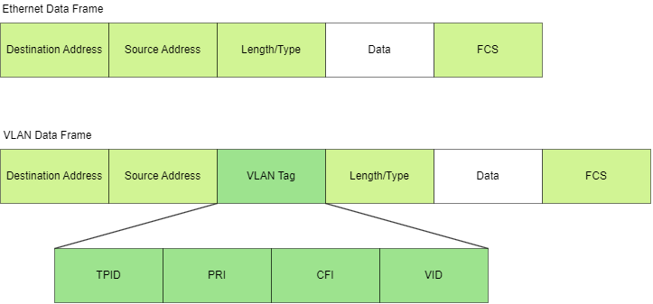
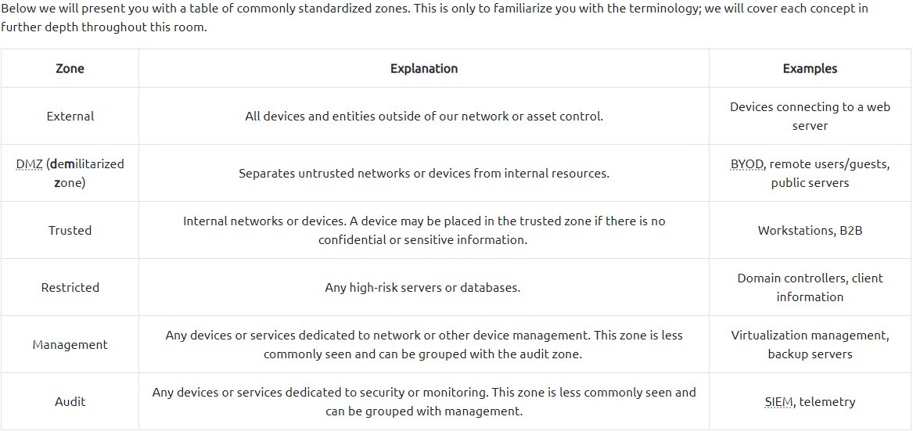

Secure Network Architecture
========================
Based on: https://tryhackme.com/room/introtosecurityarchitecture

# VLANs
The Need for Secure Segmentation
Subnets seem to solve all problems a network may face; why would we use another solution? To answer this question, let’s consider a scenario where a client brings in their own device, a common practice known as BYOD (Bring Your Own Device). The client’s device was infected with a Remote Access Trojan (RAT) that will attempt to traverse the network the device is connected to and exfiltrate any sensitive information. With subnetting in place, there is no restriction in place as to where the infected device could connect as long as the proper routes are in place, leaving sensitive information and servers open to the unknown device. How do we fix this problem? VLANs!

VLANs (Virtual LAN) are used to segment portions of a network at layer two and differentiate devices.

VLANs are configured on a switch by adding a "tag" to a frame. The 802.1q or dot1q tag will designate the VLAN that the traffic originated from.

The 802.1 tag provides a standard between vendors that will always define the VLAN of a frame. For example, if our switches are Cisco and our routers are Juniper, they can send tagged frames and digest them equally because it is standardized. As a demonstration, we will show how to configure tags on the interfaces of a switch.

# Common Secure Network Architecture
With the introduction of VLANs, there is a shift in network architecture design to include security as a key consideration. Security, optimization, and redundancy should all be considered when designing a network, ideally without compromising one component.

This brings us to the question, how do we properly implement VLANs as a security boundary? Security zones! Security zones define what or who is in a VLAN and how traffic can travel in and out.

Depending on whom you speak to, every network architect may have a different approach/opinion to the language or requirements surrounding security zones. In this task, we will immerse you in the most commonly accepted security zone standards, keeping a minimalist approach to segmentation.

While security zones mostly factor in what will happen internally, it is equally important to consider how new traffic or devices will enter the network, be assigned, and interact with internal systems. Most external traffic (HTTP, mail, etc.) will stay in the DMZ, but what if a remote user needs access to an internal resource? We can easily create rules for resources a user or device can access based on MAC, IP addresses, etc. We can then enforce these rules from network security controls; in the next task, we will discuss various access controls and solutions to implement policies.

