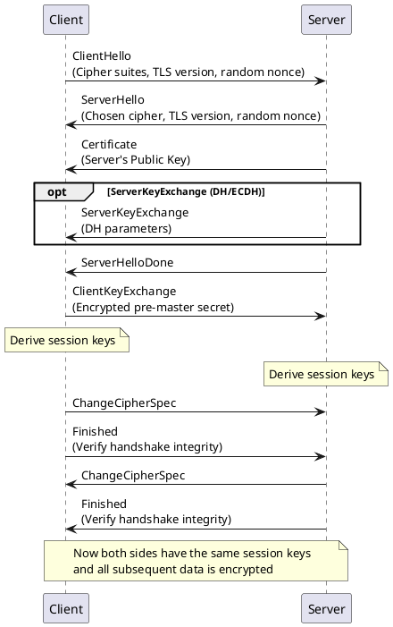
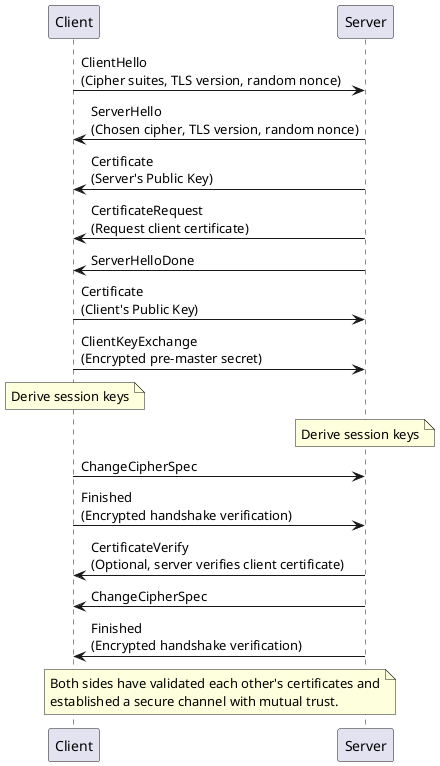

# TLS and mTLS Overview

**Transport Layer Security (TLS)** is the successor to **Secure Sockets Layer (SSL)** and provides a cryptographic protocol designed to ensure **confidentiality**, **integrity**, and **authenticity** of data in transit. When a client and server communicate over TLS, they perform a handshake to negotiate cryptographic parameters, authenticate one or both parties (depending on configuration), and derive a shared **session key** to protect subsequent data exchanges.

**Mutual TLS (mTLS)** extends standard TLS by requiring **both** the server **and** the client to present certificates to authenticate each other. This mutual authentication provides stronger trust guarantees because each side can verify the identity of the other.

Below, we delve into the technical details of **TLS** and **mTLS**, including **sequence diagrams** (in PlantUML) illustrating the key messages exchanged during the handshake.

---

## TLS Handshake in Detail

### High-Level Steps

1. **ClientHello**
   - The client sends a list of **supported protocols**, **cipher suites**, and other **TLS capabilities** (e.g., supported TLS version, random nonce, compression methods).
2. **ServerHello**
   - The server picks a **cipher suite**, **TLS version**, and generates its own random value.
   - The server also sends its **certificate** to the client (for server authentication).
   - If **ServerKeyExchange** is required (e.g., Diffie-Hellman parameters), the server provides it.
   - **ServerHelloDone** indicates the end of the server’s part of the handshake.
3. **ClientKeyExchange**
   - The client generates **pre-master secret** or provides parameters needed to derive the session key (e.g., with Diffie-Hellman).
   - Sends it to the server, typically encrypted with the server’s **public key**.
4. **ChangeCipherSpec & Finished** (Client)
   - The client tells the server that **subsequent messages** will be encrypted under the newly established session keys.
   - Sends a **Finished** message (encrypted) to verify the handshake integrity.
5. **ChangeCipherSpec & Finished** (Server)
   - The server also switches to encryption mode with the negotiated session keys.
   - Sends a **Finished** message to confirm the handshake integrity.

### PlantUML Sequence Diagram (TLS)

Below is a **simplified** TLS 1.2 handshake flow.

---

## Mutual TLS (mTLS)

**mTLS** builds upon the TLS handshake by adding **client authentication**. In a standard TLS handshake, only the server presents a certificate. In mTLS, **both sides** (server and client) present certificates to **authenticate each other**.

### High-Level Steps

1. **ClientHello**
   - Client advertises its TLS capabilities as usual.
2. **ServerHello + Certificate Request**
   - Server picks **cipher suite** and sends its **server certificate**.
   - **Crucially**, the server also includes a **CertificateRequest** message, asking for the client’s certificate.
3. **Client Certificate + ClientKeyExchange**
   - Client sends its **certificate** to prove its identity.
   - Client completes key exchange details.
4. **ChangeCipherSpec & Finished** (Client)
   - Switches to encrypted mode, sends **Finished**.
5. **Server Verifies Client Certificate**, then **ChangeCipherSpec & Finished**
   - Server validates the authenticity of the client’s certificate.
   - Server switches to encryption mode, sends **Finished**.

Once complete, **both** sides have **authenticated** each other and established a **secure, mutually trusted channel**.

### PlantUML Sequence Diagram (mTLS)

Below is a simplified mTLS handshake flow:

---

## Cryptographic Concepts in TLS and mTLS

1. **Asymmetric Key Exchange**
   - The server’s **public key** (in its certificate) is used to **encrypt** the client’s **pre-master secret** in traditional RSA key exchanges.
   - In **Elliptic Curve Diffie-Hellman** (ECDHE) or **Diffie-Hellman** key exchanges, both sides share ephemeral parameters to arrive at the same session key.

2. **Symmetric Encryption**
   - After the handshake, a **symmetric key** (session key) is used for actual data encryption. This is faster and more efficient than asymmetric crypto.

3. **Integrity**
   - **HMAC** or other cryptographic hashing ensures message integrity. Each message is signed with a key-derived hash so that tampering can be detected.

4. **Authenticity**
   - **Server Certificate** in TLS allows the client to verify the server’s identity.
   - **Client Certificate** in mTLS allows the server to verify the client’s identity.

5. **Certificate Authorities (CAs)**
   - Public certificates are signed by **trusted** CAs. Browsers and OS trust a pre-installed list of CAs.
   - If a certificate is not signed by a recognized CA, a warning or error is displayed unless manually trusted.

---

## Use Cases

1. **Standard TLS**
   - **HTTPS** (web browsing) – server identity is verified, ensures data privacy.
   - **Secure Email** (SMTPS, IMAPS, etc.) – prevent eavesdropping.
   - **VPN tunnels** – secure connections over public networks.

2. **mTLS**
   - **Microservices** in zero-trust environments – each service must prove identity.
   - **Enterprise internal networks** – ensure that only trusted clients connect to critical services.
   - **IoT devices** – devices with client certificates can authenticate themselves to servers.

---

## Security Considerations

- **Certificate Validity**: Must not be expired or revoked.
- **Key Length & Cipher Suites**: Use robust cipher suites (e.g., TLS 1.2+ with strong elliptic curves or RSA >= 2048 bits).
- **TLS Version**: Avoid older versions (SSL 3.0, TLS 1.0, TLS 1.1) due to known vulnerabilities.
- **Certificate Revocation**: Ensure the server can check if a client’s cert is revoked (for mTLS scenarios).

---

## Summary

- **TLS** (formerly SSL) provides **encryption**, **integrity**, and **server authentication**, preventing eavesdropping (MitM) and data tampering.
- **mTLS** adds **client authentication**, making both sides present certificates and verify each other’s identity.
- The **TLS/mTLS Handshake** involves exchanging supported protocols, sending certificates, key exchange, and switching to a shared **session key** for encrypted communication.
- Modern deployments rely heavily on **certificate authorities** and robust **cipher suites** for secure communication.

## More Info
* TLS Overview - [TLS1.3](https://tls13.xargs.org/)
