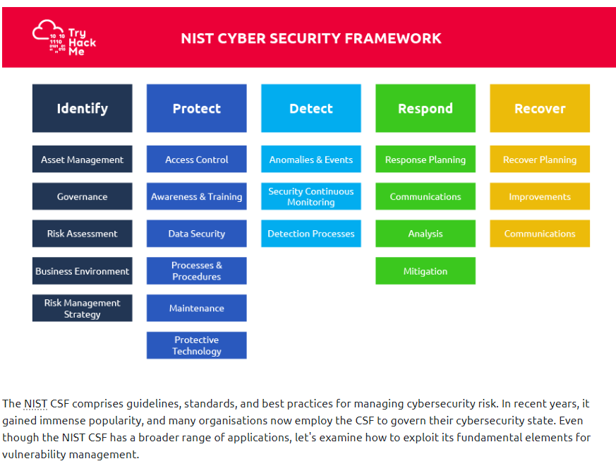

Vulnerability Management
========================

Based on: https://tryhackme.com/room/vulnerabilitymanagementkj

### Databases
* [NVD (National Vulnerability Database)](https://nvd.nist.gov/vuln)
* [Exploit-DB](http://exploit-db.com/)

* [CVE Details](https://www.cvedetails.com/)

### NIST Cybersecurity Framework
https://www.nist.gov/cyberframework

This task will briefly discuss a renowned framework used worldwide for vulnerability management. The National Institute of Standards and Technology (NIST) created the Cybersecurity Framework (CSF) as a guidance for organisations to better manage and reduce their cybersecurity risks. The NIST Cybersecurity Framework is intended as a comprehensive cyber strategy and has become a helpful risk management resource for corporate sector businesses and government entities. The fundamental components of the NIST Cybersecurity Framework are broken down into five areas applicable to vulnerability management that help to achieve the cybersecurity objectives of an organisation.

* Identify: What assets and processes require security?
* Protect: Put the right security measures in place to protect the organisation's assets.
* Detect: Implement adequate procedures to detect cybersecurity events.
* Respond: Develop methods for mitigating the effects of cybersecurity incidents.
* Recover: Implement the proper procedures for restoring capabilities and services impacted by cybersecurity incidents.

