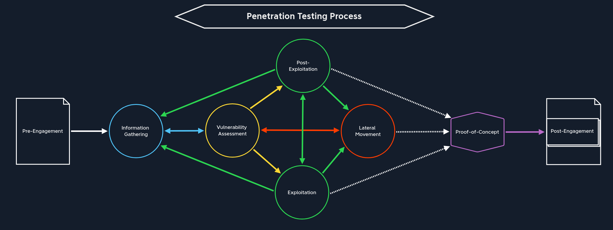

# Pentesting

> Full directory structure and methodology reference: [INDEX.md](INDEX.md)
>
> Phase-by-phase operational guide: [methodology.md](methodology.md) | Quick command reference: [CHEATSHEET.md](CHEATSHEET.md)

## Penetration Testing Stages

| Stage | Description |
|-------|-------------|
| 1. Pre-Engagement | Create all necessary documents, discuss assessment objectives, clarify scope and rules of engagement. |
| 2. Information Gathering | OSINT, subdomain enumeration, technology identification, email harvesting. See [enumeration/](enumeration/). |
| 3. Vulnerability Assessment | Service scanning, version detection, automated vulnerability scanning. See [network-security/](network-security/). |
| 4. Exploitation | Web attacks ([web-hacking/](web-hacking/)), password attacks ([password-attacks/](password-attacks/)), binary exploitation ([binary-exploitation/](binary-exploitation/)). |
| 5. Post-Exploitation | Privilege escalation ([privilege-escalation/](privilege-escalation/)), credential extraction, persistence. |
| 6. Lateral Movement | AD attacks ([active-directory/](active-directory/)), pivoting ([pivoting/](pivoting/)), Pass-the-Hash, Kerberos. |
| 7. Proof-of-Concept | Automate exploit chain, document reproduction steps. |
| 8. Post-Engagement | Report writing, walkthrough meeting, remediation support. |

## Key Directories

| Directory | Content |
|-----------|---------|
| [enumeration/](enumeration/) | OSINT, DNS, scanning, web/SMB/LDAP/SNMP enumeration |
| [web-hacking/](web-hacking/) | SQLi, XSS, SSRF, XXE, file inclusion, deserialization, API testing |
| [active-directory/](active-directory/) | BloodHound, Kerberoasting, DCSync, lateral movement |
| [password-attacks/](password-attacks/) | Hashcat, John, Hydra, credential extraction, wordlists |
| [privilege-escalation/](privilege-escalation/) | Linux & Windows privesc techniques |
| [shells-and-payloads/](shells-and-payloads/) | Reverse shells, shell upgrades, file transfers, msfvenom |
| [pivoting/](pivoting/) | SSH tunnels, Chisel, Ligolo-ng, SOCKS proxies |
| [binary-exploitation/](binary-exploitation/) | Buffer overflow, ROP, format strings |
| [forensics-ir/](forensics-ir/) | Memory forensics (Volatility), disk forensics, incident response |
