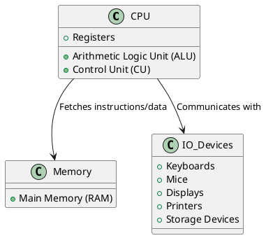
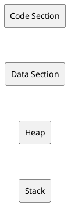
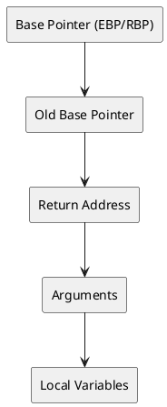
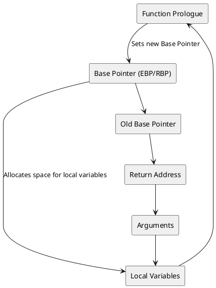

# Technical Note: Overview of x86 and x64 CPU Architectures for Malware Analysis

## Introduction

Understanding the underlying **x86** and **x64** CPU architectures is crucial for malware analysts. Malware often exploits architectural features and vulnerabilities to perform malicious activities. This technical note provides an overview of the **x86** and **x64** architectures, focusing on their components, registers, memory layout, and stack structure from a malware analysis perspective. While comprehensive, some intricate details are omitted to maintain relevance to malware analysis.

## Learning Objectives

By the end of this note, you will be able to:

1. **Understand** the basic components of CPU architecture.
2. **Identify** different types of CPU registers and their usage.
3. **Comprehend** the memory layout as viewed by a program.
4. **Analyze** the stack layout and stack registers.
5. **Visualize** key architectural components using diagrams.

## Key Technical Terms

- **CPU Architecture**
- **Arithmetic Logic Unit (ALU)**
- **Control Unit (CU)**
- **Registers**
- **Instruction Pointer (IP)**
- **General-Purpose Registers**
- **Status Flag Registers**
- **Segment Registers**
- **Memory Layout**
- **Stack Layout**
- **Stack Buffer Overflow**
- **Digital Forensics**

## Overview of CPU Architecture and Its Components

### Von Neumann Architecture

The **Von Neumann architecture** is the foundation for most modern CPUs, including **x86** and **x64**. It consists of the following key components:

- **Arithmetic Logic Unit (ALU):** Performs arithmetic and logical operations.
- **Control Unit (CU):** Fetches instructions from memory, decodes them, and executes them by coordinating with the ALU and other components.
- **Registers:** Small, fast storage locations within the CPU that hold data and instructions temporarily.
- **Main Memory (RAM):** Stores program code and data that the CPU accesses during execution.
- **I/O Devices:** Interfaces through which the CPU communicates with external peripherals like keyboards, mice, and storage devices.

### CPU Components Diagram

## Types of CPU Registers and Their Usage

Registers are critical for the CPU's operation, providing rapid access to data and instructions. They are categorized into several types:

### Instruction Pointer (IP)

- **Purpose:** Holds the address of the next instruction to execute.
- **Variants:**
  - **16-bit:** IP (used in Intel 8086)
  - **32-bit:** EIP (Extended Instruction Pointer)
  - **64-bit:** RIP (Register Instruction Pointer)

### General-Purpose Registers

Used for a variety of functions during instruction execution.

| **Register** | **32-bit** | **64-bit** | **Description** |
|--------------|------------|------------|------------------|
| **EAX/RAX**  | EAX        | RAX        | Accumulator for arithmetic operations |
| **EBX/RBX**  | EBX        | RBX        | Base register for memory addressing |
| **ECX/RCX**  | ECX        | RCX        | Counter register for loops and shifts |
| **EDX/RDX**  | EDX        | RDX        | Data register for I/O operations |
| **ESP/RSP**  | ESP        | RSP        | Stack Pointer |
| **EBP/RBP**  | EBP        | RBP        | Base Pointer for stack frames |
| **ESI/RSI**  | ESI        | RSI        | Source Index for string operations |
| **EDI/RDI**  | EDI        | RDI        | Destination Index for string operations |
| **R8-R15**   | N/A        | R8-R15     | Additional general-purpose registers |

### Status Flag Registers

Maintain flags that indicate the status of operations.

- **EFLAGS/RFLAGS:**
  - **Zero Flag (ZF):** Indicates if the result of the last operation was zero.
  - **Carry Flag (CF):** Indicates an overflow in arithmetic operations.
  - **Sign Flag (SF):** Indicates if the result of an operation is negative.
  - **Trap Flag (TF):** Indicates if the CPU is in debugging mode.

### Segment Registers

Facilitate memory segmentation for efficient addressing.

| **Segment Register** | **Description**                      |
|----------------------|--------------------------------------|
| **CS**               | Code Segment                         |
| **DS**               | Data Segment                         |
| **SS**               | Stack Segment                        |
| **ES, FS, GS**       | Extra Segments for additional data   |

### Registers Overview Table

| **Register Type**         | **Registers**                                                                 | **Description**                                                                                     |
|---------------------------|-------------------------------------------------------------------------------|-----------------------------------------------------------------------------------------------------|
| **Instruction Pointer**   | IP, EIP, RIP                                                                  | Holds the address of the next instruction to execute.                                              |
| **General-Purpose**       | EAX/RAX, EBX/RBX, ECX/RCX, EDX/RDX, ESP/RSP, EBP/RBP, ESI/RSI, EDI/RDI, R8-R15 | Used for arithmetic, data manipulation, addressing, and various control operations.                |
| **Status Flag**           | EFLAGS/RFLAGS                                                                 | Contains flags that indicate the status of arithmetic and logical operations.                      |
| **Segment**               | CS, DS, SS, ES, FS, GS                                                        | Used to segment memory for code, data, stack, and extra data sections.                             |

## Memory Layout as Viewed by a Program

In **x86** and **x64** architectures, memory is abstracted into various sections when a program is executed. Understanding this layout is vital for malware analysis and reverse engineering.

### Typical Memory Layout

| **Memory Section** | **Description**                                                                                                  |
|--------------------|------------------------------------------------------------------------------------------------------------------|
| **Code**           | Contains executable instructions (text section) with execute permissions.                                        |
| **Data**           | Holds initialized global and static variables that remain constant during execution.                             |
| **Heap**           | Used for dynamic memory allocation; stores variables and data created/deleted at runtime.                        |
| **Stack**          | Stores local variables, function arguments, return addresses, and controls the program's execution flow.         |

## Stack Layout and Stack Registers

The **stack** is a critical component in program execution, particularly in the context of malware analysis. It manages function calls, local variables, and control flow, making it a common target for exploits like buffer overflows.

### Stack Structure

| **Stack Component**       | **Description**                                                                                             |
|---------------------------|-------------------------------------------------------------------------------------------------------------|
| **Stack Pointer (ESP/RSP)** | Points to the top of the stack; adjusts as data is pushed or popped.                                        |
| **Base Pointer (EBP/RBP)**  | References the base of the current stack frame; remains constant during function execution.                  |
| **Old Base Pointer**        | Holds the base pointer of the calling function; used to restore the previous stack frame.                   |
| **Return Address**          | Stores the address to return to after a function call completes.                                            |
| **Arguments**               | Contains the parameters passed to functions.                                                                |
| **Local Variables**         | Stores variables declared within the function scope.                                                        |

### Stack Buffer Overflow Exploit

A common malware technique involves overwriting the **Return Address** on the stack to redirect the execution flow to malicious code. This is achieved by exploiting vulnerabilities like buffer overflows.

## Detailed Components Overview

### Control Unit (CU)

- **Function:** Fetches instructions from **Main Memory**, decodes them, and coordinates their execution.
- **Instruction Pointer (IP):**
  - **32-bit Systems:** EIP
  - **64-bit Systems:** RIP

### Arithmetic Logic Unit (ALU)

- **Function:** Executes arithmetic and logical operations as instructed by the CU.
- **Output:** Results are stored in **Registers** or **Main Memory**.

### Registers

Registers provide fast access storage within the CPU. Their efficient use is essential for optimal performance and is often exploited by malware to manipulate program execution.

#### Instruction Pointer

- **IP (16-bit) → EIP (32-bit) → RIP (64-bit)**
- **Role:** Determines the sequence of instruction execution.

#### General-Purpose Registers

Used for various operations, these registers are central to executing instructions and managing data flow.

- **EAX/RAX (Accumulator):** Stores results of arithmetic operations.
- **EBX/RBX (Base):** Holds base addresses for memory access.
- **ECX/RCX (Counter):** Used in loop counters and shifts.
- **EDX/RDX (Data):** Facilitates I/O operations.
- **ESP/RSP (Stack Pointer):** Points to the top of the stack.
- **EBP/RBP (Base Pointer):** References the base of the current stack frame.
- **ESI/RSI (Source Index) & EDI/RDI (Destination Index):** Used in string and memory operations.
- **R8-R15:** Additional general-purpose registers in **x64** architecture.

#### Status Flag Registers

- **EFLAGS/RFLAGS:**
  - **ZF (Zero Flag):** Set if the result of an operation is zero.
  - **CF (Carry Flag):** Indicates arithmetic overflow.
  - **SF (Sign Flag):** Reflects the sign of the result.
  - **TF (Trap Flag):** Enables single-step debugging mode.

#### Segment Registers

Enable the segmentation of memory to optimize access and management.

- **CS (Code Segment):** Points to the code section.
- **DS (Data Segment):** Points to the data section.
- **SS (Stack Segment):** Points to the stack.
- **ES, FS, GS (Extra Segments):** Point to additional data segments.

### Memory Layout

Understanding memory layout is vital for malware analysis as it helps in identifying how malware interacts with different memory sections.

#### Code Section

- **Contains:** Executable instructions (text section) with execute permissions.
- **Importance:** Malware often injects code here to execute malicious instructions.

#### Data Section

- **Contains:** Initialized global and static variables.
- **Importance:** Malware may manipulate these variables to alter program behavior.

#### Heap

- **Contains:** Dynamically allocated memory; used for variables and data created at runtime.
- **Importance:** Malware may exploit heap memory for allocating malicious code or data.

#### Stack

- **Contains:** Local variables, function arguments, return addresses.
- **Importance:** Common target for buffer overflow attacks to hijack control flow.

### Stack Layout

The stack follows a **Last In, First Out (LIFO)** structure, managed by the **Stack Pointer (ESP/RSP)** and **Base Pointer (EBP/RBP)**.

#### Function Prologue and Epilogue

- **Function Prologue:** Sets up the stack frame by pushing the current **Base Pointer** and setting the new **Base Pointer** to the current **Stack Pointer**.
- **Function Epilogue:** Restores the previous **Base Pointer** and **Stack Pointer**, and returns control to the caller using the **Return Address**.

## PlantUML Diagrams

### Stack Layout Diagram

### CPU Components Diagram

### General-Purpose Registers Breakdown
| Register   | 32-bit | 64-bit   | Description                                |
|------------|--------|----------|--------------------------------------------|
| EAX/RAX    | EAX    | RAX      | Accumulator for arithmetic operations      |
| EBX/RBX    | EBX    | RBX      | Base register for memory addressing        |
| ECX/RCX    | ECX    | RCX      | Counter register for loops and shifts      |
| EDX/RDX    | EDX    | RDX      | Data register for I/O operations           |
| ESP/RSP    | ESP    | RSP      | Stack Pointer                              |
| EBP/RBP    | EBP    | RBP      | Base Pointer                               |
| ESI/RSI    | ESI    | RSI      | Source Index for string operations         |
| EDI/RDI    | EDI    | RDI      | Destination Index for string operations    |
| R8-R15     | N/A    | R8-R15   | Additional general-purpose registers in x64 |

## Conclusion

A comprehensive understanding of the **x86** and **x64** CPU architectures is essential for malware analysts. By familiarizing yourself with CPU components, various types of registers, memory layouts, and stack structures, you can better analyze how malware interacts with system resources and exploits architectural features. This knowledge forms the foundation for effective malware detection, analysis, and mitigation strategies.

## References

1. **Intel® 64 and IA-32 Architectures Software Developer Manuals**: [Intel Documentation](https://software.intel.com/content/www/us/en/develop/articles/intel-sdm.html)
2. **AMD64 Architecture Programmer’s Manual**: [AMD Documentation](https://developer.amd.com/resources/developer-guides-manuals/)
3. **NIST Special Publication 800-125**: *The Developer’s Guide to Information Security*.
4. **Malware Analysis Techniques**: **SANS Institute**.
5. **Reverse Engineering Malware**: **Practical Malware Analysis** by Michael Sikorski and Andrew Honig.
