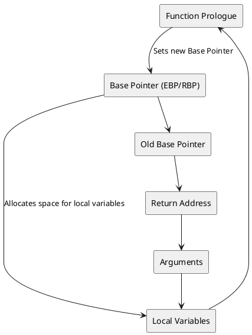
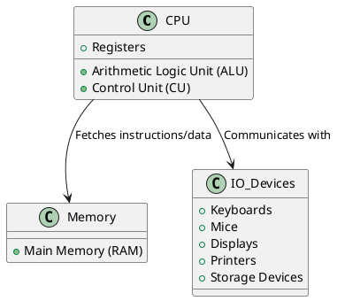
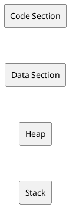

# Technical Note: Introduction to x86/x64 Assembly Language for Malware Analysis

## Introduction

Assembly language serves as a critical tool for understanding low-level system operations, making it indispensable for malware analysis. By delving into **x86** and **x64** assembly languages, cybersecurity professionals can dissect malicious code, identify vulnerabilities, and develop effective countermeasures. This technical note provides a comprehensive overview of x86/x64 assembly language, complete with examples and code snippets to facilitate practical learning.

## Learning Objectives

By the end of this note, you will be able to:

1. **Understand** the fundamentals of assembly language and its role in system architecture.
2. **Differentiate** between x86 and x64 assembly languages.
3. **Identify** and utilize various CPU registers in assembly programming.
4. **Implement** basic assembly instructions and constructs.
5. **Analyze** assembly code snippets relevant to malware behavior.
6. **Apply** assembly language concepts in reverse engineering and malware analysis.

## Key Technical Terms

- **Assembly Language**
- **x86 Architecture**
- **x64 Architecture**
- **Registers**
- **Mnemonics**
- **Operands**
- **Addressing Modes**
- **Stack**
- **Calling Conventions**
- **Shellcode**
- **Opcode**
- **Instruction Pointer (IP/RIP)**
- **Stack Pointer (SP/RSP)**
- **Base Pointer (BP/RBP)**
- **Function Prologue/Epilogue**

## Overview of x86/x64 Assembly Language

### What is Assembly Language?

**Assembly Language** is a low-level programming language that provides a symbolic representation of a computer's machine code. Unlike high-level languages (e.g., Python, Java), assembly language is closely tied to the architecture of the CPU, allowing direct manipulation of hardware components and memory. It uses **mnemonics** to represent machine instructions, making it more readable for humans.

### x86 vs. x64 Assembly

- **x86 Architecture:**
  - Refers to the 32-bit instruction set architecture (ISA) introduced by Intel with the 8086 processor.
  - Utilizes 32-bit registers (e.g., EAX, EBX).
  - Supports a maximum of 4 GB of RAM.

- **x64 Architecture:**
  - An extension of x86, also known as AMD64 or Intel 64.
  - Supports 64-bit registers (e.g., RAX, RBX).
  - Can address significantly more memory (up to 16 exabytes theoretically).
  - Introduces additional general-purpose registers (R8-R15).

### CPU Components Relevant to Assembly

- **Arithmetic Logic Unit (ALU):** Performs arithmetic and logical operations.
- **Control Unit (CU):** Manages the execution of instructions.
- **Registers:** High-speed storage locations within the CPU.
- **Stack:** A special region of memory used for function calls and local variables.
- **Instruction Pointer (IP/RIP):** Points to the next instruction to execute.

## Assembly Language Basics

### Syntax and Structure

Assembly language syntax varies slightly between different assemblers (e.g., NASM, MASM, GAS). However, the fundamental structure remains consistent:

```assembly
section .data
    ; Data declarations

section .bss
    ; Uninitialized data

section .text
    global _start

_start:
    ; Instructions
```

- **Sections:**
  - **.data:** Contains initialized data.
  - **.bss:** Contains uninitialized data.
  - **.text:** Contains executable instructions.

### Instructions and Mnemonics

**Instructions** are the commands that the CPU executes. Each instruction has a **mnemonic** (symbolic name) and may include one or more **operands**.

**Common Mnemonics:**

- `MOV`: Move data from one location to another.
- `ADD`: Add two operands.
- `SUB`: Subtract one operand from another.
- `PUSH`: Push data onto the stack.
- `POP`: Pop data from the stack.
- `CALL`: Call a procedure.
- `RET`: Return from a procedure.
- `JMP`: Jump to a specified instruction.
- `CMP`: Compare two operands.
- `JE/JZ`: Jump if equal/zero.
- `JNE/JNZ`: Jump if not equal/non-zero.

### Example: Hello World in x86 Assembly

```assembly
section .data
    msg db 'Hello, World!', 0xA  ; Define a string with a newline
    len equ $ - msg               ; Calculate the length of the string

section .text
    global _start

_start:
    ; Write the message to stdout
    mov eax, 4        ; syscall number for sys_write
    mov ebx, 1        ; file descriptor 1 (stdout)
    mov ecx, msg      ; pointer to the message
    mov edx, len      ; message length
    int 0x80          ; call kernel

    ; Exit the program
    mov eax, 1        ; syscall number for sys_exit
    xor ebx, ebx      ; exit code 0
    int 0x80          ; call kernel
```

**Explanation:**

1. **Data Section:**
   - `msg`: Stores the string "Hello, World!\n".
   - `len`: Calculates the length of `msg`.

2. **Text Section:**
   - `_start`: Entry point of the program.
   - **sys_write syscall:**
     - `eax = 4`: Syscall number for `sys_write`.
     - `ebx = 1`: File descriptor for stdout.
     - `ecx = msg`: Pointer to the message.
     - `edx = len`: Length of the message.
     - `int 0x80`: Interrupt to invoke the syscall.
   - **sys_exit syscall:**
     - `eax = 1`: Syscall number for `sys_exit`.
     - `ebx = 0`: Exit code.
     - `int 0x80`: Interrupt to invoke the syscall.

### Compiling and Running Assembly Code

To compile and run the above x86 assembly code using NASM and GCC:

```bash
nasm -f elf32 hello.asm -o hello.o
gcc -m32 hello.o -o hello
./hello
```

**Output:**

```
Hello, World!
```

## Registers in x86/x64 Assembly

Registers are small storage locations within the CPU that hold data, addresses, and control information. Understanding registers is fundamental to writing and analyzing assembly code.

### General-Purpose Registers

| **Register** | **32-bit (x86)** | **64-bit (x64)** | **Description**                                      |
|--------------|------------------|------------------|------------------------------------------------------|
| **EAX/RAX**  | EAX              | RAX              | Accumulator for arithmetic operations               |
| **EBX/RBX**  | EBX              | RBX              | Base register for memory addressing                |
| **ECX/RCX**  | ECX              | RCX              | Counter for loops and shifts                       |
| **EDX/RDX**  | EDX              | RDX              | Data register for I/O operations                   |
| **ESP/RSP**  | ESP              | RSP              | Stack Pointer                                       |
| **EBP/RBP**  | EBP              | RBP              | Base Pointer for stack frames                      |
| **ESI/RSI**  | ESI              | RSI              | Source Index for string operations                 |
| **EDI/RDI**  | EDI              | RDI              | Destination Index for string operations            |
| **R8-R15**   | N/A              | R8-R15           | Additional general-purpose registers in x64         |

### Special Registers

| **Register**   | **32-bit (x86)** | **64-bit (x64)** | **Description**                                      |
|----------------|------------------|------------------|------------------------------------------------------|
| **EIP/RIP**    | EIP              | RIP              | Instruction Pointer                                  |
| **EFLAGS/RFLAGS** | EFLAGS         | RFLAGS           | Status Flags and Control Bits                       |
| **CS**         | CS               | CS               | Code Segment                                         |
| **DS**         | DS               | DS               | Data Segment                                         |
| **SS**         | SS               | SS               | Stack Segment                                        |
| **ES, FS, GS** | ES, FS, GS       | ES, FS, GS       | Extra Segments for additional data                   |

### Instruction Pointer (IP/RIP)

- **Role:** Holds the address of the next instruction to execute.
- **Variants:**
  - **16-bit:** IP (used in Intel 8086)
  - **32-bit:** EIP (Extended Instruction Pointer)
  - **64-bit:** RIP (Register Instruction Pointer)

### Stack Pointer (SP/RSP) and Base Pointer (BP/RBP)

- **Stack Pointer (SP/RSP):** Points to the top of the stack. Adjusts as data is pushed or popped.
- **Base Pointer (BP/RBP):** References the base of the current stack frame. Remains constant during function execution.

## Addressing Modes

Addressing modes determine how operands are accessed in assembly instructions. Common addressing modes include:

1. **Immediate Addressing:** Operand is a constant value.
   ```assembly
   MOV EAX, 5   ; Move the constant value 5 into EAX
   ```

2. **Register Addressing:** Operand is a register.
   ```assembly
   MOV EBX, EAX ; Move the value from EAX into EBX
   ```

3. **Direct Addressing:** Operand is a memory address.
   ```assembly
   MOV EAX, [0x00400000] ; Move the value at memory address 0x00400000 into EAX
   ```

4. **Indirect Addressing:** Operand is a memory address stored in a register.
   ```assembly
   MOV EAX, [EBX] ; Move the value at the address stored in EBX into EAX
   ```

5. **Indexed Addressing:** Combines a base register and an index register.
   ```assembly
   MOV EAX, [EBX + ECX*4] ; Move the value at (EBX + ECX*4) into EAX
   ```

6. **Base-Indexed with Displacement:**
   ```assembly
   MOV EAX, [EBX + ECX*4 + 8] ; Move the value at (EBX + ECX*4 + 8) into EAX
   ```

## Example Code Snippets

### Basic Arithmetic Operations

```assembly
section .text
    global _start

_start:
    MOV EAX, 10     ; Load 10 into EAX
    MOV EBX, 20     ; Load 20 into EBX
    ADD EAX, EBX    ; EAX = EAX + EBX (30)
    SUB EBX, 5      ; EBX = EBX - 5 (15)

    ; Exit
    MOV eax, 1      ; sys_exit
    XOR ebx, ebx    ; exit code 0
    INT 0x80
```

### Looping Structures

```assembly
section .text
    global _start

_start:
    MOV ECX, 5          ; Set loop counter to 5

loop_start:
    ; Perform some operations
    ADD EAX, 1          ; Increment EAX
    LOOP loop_start     ; Decrement ECX and loop if ECX != 0

    ; Exit
    MOV eax, 1          ; sys_exit
    XOR ebx, ebx        ; exit code 0
    INT 0x80
```

**Explanation:**

- **LOOP Instruction:**
  - Decrements ECX.
  - Jumps to the specified label (`loop_start`) if ECX is not zero.

### Function Calls

```assembly
section .text
    global _start

_start:
    CALL my_function    ; Call the function
    ; After function returns
    MOV eax, 1          ; sys_exit
    XOR ebx, ebx        ; exit code 0
    INT 0x80

my_function:
    PUSH EBP            ; Function prologue
    MOV EBP, ESP

    ; Function body
    MOV EAX, 42         ; Example operation

    MOV ESP, EBP        ; Function epilogue
    POP EBP
    RET                 ; Return to caller
```

**Explanation:**

1. **CALL my_function:** Pushes the return address onto the stack and jumps to `my_function`.
2. **Function Prologue:**
   - `PUSH EBP`: Saves the old base pointer.
   - `MOV EBP, ESP`: Sets the new base pointer.
3. **Function Body:** Performs operations (e.g., setting `EAX` to 42).
4. **Function Epilogue:**
   - `MOV ESP, EBP`: Restores the stack pointer.
   - `POP EBP`: Restores the old base pointer.
   - `RET`: Pops the return address from the stack and jumps back.

### Stack Manipulation

```assembly
section .text
    global _start

_start:
    PUSH EAX            ; Push EAX onto the stack
    MOV EAX, 100        ; Set EAX to 100
    POP EBX             ; Pop the value from the stack into EBX

    ; EBX now contains the original value of EAX

    ; Exit
    MOV eax, 1          ; sys_exit
    XOR ebx, ebx        ; exit code 0
    INT 0x80
```

**Explanation:**

- **PUSH EAX:** Saves the current value of EAX on the stack.
- **MOV EAX, 100:** Changes the value of EAX.
- **POP EBX:** Retrieves the original value of EAX from the stack and stores it in EBX.

## Advanced Topics

### Calling Conventions

**Calling Conventions** define how functions receive parameters and return values, as well as how the call stack is managed. Common calling conventions include:

- **cdecl:** Caller cleans the stack. Parameters are pushed right to left.
- **stdcall:** Callee cleans the stack. Parameters are pushed right to left.
- **fastcall:** Passes some parameters via registers.

**Example: cdecl Calling Convention**

```assembly
; Function: int add(int a, int b)
add:
    push ebp
    mov ebp, esp
    mov eax, [ebp+8]    ; a
    add eax, [ebp+12]   ; b
    pop ebp
    ret
```

### Interrupts

**Interrupts** are signals that notify the CPU of events needing immediate attention. They can be hardware or software interrupts.

- **Software Interrupts:** Triggered by software instructions (e.g., `INT 0x80` for syscalls in Linux).
- **Hardware Interrupts:** Triggered by hardware devices (e.g., keyboard input).

**Example: Software Interrupt for Syscall**

```assembly
MOV eax, 4      ; sys_write
MOV ebx, 1      ; file descriptor (stdout)
MOV ecx, msg    ; message to write
MOV edx, len    ; message length
INT 0x80        ; invoke syscall
```

### System Calls

**System Calls** provide an interface for user-space applications to request services from the kernel (e.g., file operations, process control).

**Example: sys_exit and sys_write**

```assembly
section .data
    msg db 'Hello, Syscall!', 0xA
    len equ $ - msg

section .text
    global _start

_start:
    ; sys_write(stdout, msg, len)
    MOV eax, 4      ; sys_write
    MOV ebx, 1      ; stdout
    MOV ecx, msg    ; message
    MOV edx, len    ; length
    INT 0x80

    ; sys_exit(0)
    MOV eax, 1      ; sys_exit
    XOR ebx, ebx    ; exit code 0
    INT 0x80
```

## Practical Examples for Malware Analysis

### Shellcode Example

**Shellcode** is a small piece of code used as the payload in the exploitation of a software vulnerability. It typically performs tasks like spawning a shell, executing commands, or opening backdoors.

**Example: Simple Shellcode to Exit**

```assembly
section .text
    global _start

_start:
    MOV eax, 1      ; sys_exit
    XOR ebx, ebx    ; exit code 0
    INT 0x80        ; invoke syscall
```

**Explanation:**

- **MOV eax, 1:** Prepares the `sys_exit` syscall.
- **XOR ebx, ebx:** Sets the exit code to 0.
- **INT 0x80:** Triggers the syscall to exit the program.

### Exploit Code Snippet: Buffer Overflow

A **Buffer Overflow** exploit overwrites the return address on the stack to redirect execution flow.

```assembly
section .text
    global _start

_start:
    ; Example vulnerable buffer
    MOV EAX, buffer
    MOV ECX, 64        ; Buffer size
    MOV EBX, 0x41414141 ; Overwrite with 'AAAA'

    ; Overflow buffer
    REP STOSD           ; Repeat storing EAX into the buffer

    ; Return to overwritten address
    RET

section .data
buffer db 64 dup(0)
```

**Explanation:**

- **REP STOSD:** Repeats the `STOSD` instruction, which stores the value in EAX into the buffer.
- **RET:** Attempts to return, but the return address has been overwritten with 'AAAA' (`0x41414141`), redirecting execution.

### Analyzing Malicious Assembly Code

**Malware often uses complex assembly instructions to obfuscate its behavior. Here's an example of XOR-based decryption:**

```assembly
section .data
    encrypted_msg db 0x1F, 0x2B, 0x3C, 0x4D, 0x00
    key db 0xFF

section .text
    global _start

_start:
    MOV ECX, 4           ; Number of bytes to decrypt
    MOV ESI, encrypted_msg
    MOV AL, [key]        ; Load XOR key

decrypt_loop:
    XOR BYTE [ESI], AL   ; Decrypt byte
    INC ESI              ; Move to next byte
    LOOP decrypt_loop

    ; Now, encrypted_msg contains the decrypted message
    ; For demonstration, write it to stdout

    MOV EAX, 4           ; sys_write
    MOV EBX, 1           ; stdout
    MOV ECX, encrypted_msg
    MOV EDX, 4           ; message length
    INT 0x80

    ; Exit
    MOV EAX, 1           ; sys_exit
    XOR EBX, EBX         ; exit code 0
    INT 0x80
```

**Explanation:**

1. **Data Section:**
   - `encrypted_msg`: Contains an encrypted message.
   - `key`: XOR key used for decryption.

2. **Text Section:**
   - **Decrypt Loop:**
     - `MOV ECX, 4`: Sets the loop counter.
     - `MOV ESI, encrypted_msg`: Points to the encrypted message.
     - `MOV AL, [key]`: Loads the XOR key.
     - `decrypt_loop`: Performs XOR decryption byte by byte.
   - **sys_write syscall:** Writes the decrypted message to stdout.
   - **sys_exit syscall:** Exits the program.

## PlantUML Diagrams

### Stack Layout Diagram



### CPU Components Diagram



### General-Purpose Registers Breakdown
| Register   | 32-bit | 64-bit   | Description                                |
|------------|--------|----------|--------------------------------------------|
| EAX/RAX    | EAX    | RAX      | Accumulator for arithmetic operations      |
| EBX/RBX    | EBX    | RBX      | Base register for memory addressing        |
| ECX/RCX    | ECX    | RCX      | Counter register for loops and shifts      |
| EDX/RDX    | EDX    | RDX      | Data register for I/O operations           |
| ESP/RSP    | ESP    | RSP      | Stack Pointer                              |
| EBP/RBP    | EBP    | RBP      | Base Pointer                               |
| ESI/RSI    | ESI    | RSI      | Source Index for string operations         |
| EDI/RDI    | EDI    | RDI      | Destination Index for string operations    |
| R8-R15     | N/A    | R8-R15   | Additional general-purpose registers in x64 |

### Memory Layout Diagram



## Conclusion
This technical note has provided a foundational overview of assembly language concepts, CPU registers, memory layout, and practical examples relevant to malware analysis.

## References

1. **Intel® 64 and IA-32 Architectures Software Developer Manuals**: [Intel Documentation](https://software.intel.com/content/www/us/en/develop/articles/intel-sdm.html)
2. **AMD64 Architecture Programmer’s Manual**: [AMD Documentation](https://developer.amd.com/resources/developer-guides-manuals/)
3. **NASM (Netwide Assembler) Documentation**: [NASM Docs](https://www.nasm.us/doc/)
4. **"The Art of Assembly Language" by Randall Hyde**: Comprehensive guide on assembly programming.
5. **"Practical Malware Analysis" by Michael Sikorski and Andrew Honig**: Techniques for analyzing and understanding malware.
6. **"Reverse Engineering for Beginners" by Dennis Yurichev**: Free resource on reverse engineering and assembly language.
7. **SANS Institute**: Incident Response and Malware Analysis Resources.
8. **NIST Special Publication 800-125**: *The Developer’s Guide to Information Security*.
