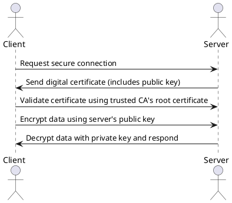
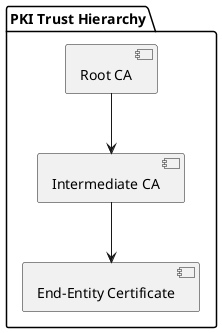

# PKI

## 1. Introduction

Public Key Infrastructure (PKI) is the backbone of secure online communications. It ensures the confidentiality, integrity, and authenticity of data exchanged over the Internet by managing digital certificates and public key cryptography. In this note, we explore the building blocks of PKI, the importance of certificate lifecycle management, and delve into the security implications—especially focusing on the exploitation risks associated with self-signed certificates.

---

## 2. PKI Overview

PKI is designed to manage encryption keys and digital certificates. It supports secure transactions, authentication of identities, and the establishment of trust between entities. At its core, PKI involves:

- **Public Key Cryptography:** Uses a key pair—a public key shared openly and a private key kept secret—to enable encryption and decryption.
- **Digital Certificates:** Act as digital IDs that bind a public key to an identity (e.g., a website, device, or individual).

Understanding these fundamentals is essential for grasping how secure online transactions are facilitated.

---

## 3. Certificate Components and Public Key Cryptography

Digital certificates contain several key components:
- **Common Name (CN):** The entity’s name for which the certificate is issued.
- **Organization (O):** The organization or entity associated with the certificate.
- **Validity Period:** Also known as the “cryptoperiod,” indicating when the certificate is issued and when it expires.
- **SHA-256 Fingerprints:** Unique identifiers for the certificate and its public key.

**Public Key Cryptography** leverages these certificates by using the public key to encrypt data and the private key to decrypt it, ensuring that even if data is intercepted, it cannot be read or tampered with without the matching key.

---

## 4. PKI Operations

PKI plays a central role in various security operations, including:

- **Authentication:** Certificates confirm the identity of entities such as users, servers, and applications.
- **Encryption:** Ensures data remains confidential during transmission.
- **Integrity Verification:** Prevents tampering with data exchanged between parties.

### PKI Authentication Diagram

Below is a PlantUML diagram that demonstrates the flow of PKI authentication between a client and a server:

This diagram shows the basic steps of PKI authentication, ensuring that the data sent by the client is secure and validated by the server.

---

## 5. Certificate Authorities and Acquiring Certificates

Certificate Authorities (CAs) are trusted third parties that issue and manage digital certificates. The process of acquiring a CA certificate generally includes:

1. **Generating a Private Key:** For example, using a 4096-bit RSA key.
2. **Creating a Certificate Signing Request (CSR):** Embeds all necessary information (e.g., organization details, public key).
3. **Submitting the CSR:** To a CA like GlobalSign or DigiCert, often involving administrative steps.

This process, while ensuring high levels of security, can be time-consuming, especially for public-facing services.

---

## 6. Self-Signed Certificates vs. Trusted CA Certificates

**Self-Signed Certificates:**
- Created and signed by the same entity.
- Useful for development or internal, air-gapped environments.
- Not trusted by browsers due to the lack of third-party verification.

**Trusted CA Certificates:**
- Issued by recognized Certificate Authorities.
- Provide third-party verification, ensuring that the certificate is legitimate.
- Preferred for public services where trust and security are paramount.

**Exploitation Risks with Self-Signed Certificates:**
- **Man-in-the-Middle (MitM) Attacks:** Without third-party validation, attackers can present fraudulent self-signed certificates to intercept or alter communications.
- **Lack of Revocation Mechanisms:** Self-signed certificates often lack robust revocation and monitoring capabilities, making it harder to mitigate compromised certificates.
- **Trust Issues:** Users and browsers will generate warnings, potentially leading to user distrust and security bypasses.

Mitigating these risks involves strict control over certificate issuance, monitoring of certificate usage, and enforcing best practices in key management.

---

## 7. PKI Trust Hierarchy and Chain of Trust

PKI relies on a hierarchical trust model:
- **Root Certificate Authorities:** The most trusted entities that issue root certificates. These are pre-installed in browsers and operating systems.
- **Intermediate Certificate Authorities:** Issued by root CAs, these act as a buffer to protect the root certificate.
- **End-Entity Certificates:** Issued to individual servers, users, or devices, forming the final link in the chain of trust.

### Trust Hierarchy Diagram

The following PlantUML diagram illustrates the chain of trust:

This diagram highlights the chain from the root CA through intermediate authorities down to the end-user certificate, emphasizing the importance of each link for maintaining trust.

---

## 8. Certificate Formats

Digital certificates come in various formats depending on their use case:

- **PFX:** Contains both the private key and certificates; used mainly on Windows.
- **CSR:** Used to request a certificate from a CA.
- **CER/CRT:** Store X.509 certificates; usually encoded in Base64.
- **PEM:** Common on Linux; stores certificates and keys.
- **P7b:** Used for chain certificates; does not contain private keys.

Each format has its advantages and specific use scenarios within PKI operations.

---

## 9. PKI Best Practices and Challenges

### Key Management
- **Secure Storage:** Utilize Hardware Security Modules (HSMs) or encrypted storage solutions.
- **Key Rotation:** Regularly rotate keys before expiry (typically 60-90 days prior).
- **Backup & Recovery:** Ensure robust strategies to avoid data loss in case of disasters.
- **Access Control & Logging:** Implement Role-Based Access Control (RBAC) and maintain audit trails.

### Patching and Updating
- Regular updates of PKI components (CA servers, certificate inventories) are essential to prevent vulnerabilities due to outdated systems.

---

## 10. Certificate Revocation and Renewal

Effective lifecycle management includes:
- **Automated Certificate Renewal:** To avoid manual errors and delays.
- **Revocation Mechanisms:** Use Certificate Revocation Lists (CRLs) and the Online Certificate Status Protocol (OCSP) for real-time validation.
- **Expiry Monitoring:** Active monitoring of expiration dates to prevent service outages.

---

## 11. Certificate Transparency and Logging

Certificate Transparency (CT) is an open framework for monitoring and auditing certificates. CT logs help:
- Detect unauthorized certificate issuance.
- Integrate with SIEM systems to map anomalies.
- Establish reporting mechanisms for fraudulent certificates.

---

## 12. Exploiting Self-Signed Certificates

While self-signed certificates are useful in controlled environments, their misuse can lead to significant security risks:
- **Deception and Impersonation:** Attackers can create self-signed certificates to mimic trusted entities, potentially deceiving users and systems.
- **Mitigation Strategies:**
  - Restrict usage to internal environments.
  - Combine with strong internal controls and continuous monitoring.
  - Educate users about the risks associated with bypassing browser warnings.

Security teams must weigh the convenience of self-signed certificates against the trust and verification provided by trusted CAs.

---

## 13. Conclusion

PKI remains a cornerstone of modern cybersecurity, ensuring secure and trustworthy online communications. Proper management of digital certificates—from issuance and renewal to revocation—is vital for maintaining security. Additionally, understanding the differences between self-signed and trusted certificates helps organizations mitigate risks associated with certificate misuse.

Implementing automated processes, leveraging strong key management practices, and continuously monitoring for anomalies can significantly enhance an organization's security posture. Always remember that the integrity of the entire trust chain is only as strong as its weakest link.
